# 1BRC C++ implementation report

This repository contains my C++ implementation of the [1 Billion Row Challenge](https://1brc.dev/).

## Summary

The problem is to write a program that processes a very large number of station-temperature pairs and calculates the minimum, maximum, and average temperature for each station as fast as possible.

To solve this problem, I started by implementing the most straightforward C++ version first. This was useful for checking correctness and also gave me a baseline for comparison.

After that, my first goal was to make a well-optimized single-threaded implementation. For each optimization step, I used `samply` to profile the program, looked at the flame graph, and improved the most obvious hotspot one by one.

Once the single-threaded version became hard to improve further, I moved on to a multi-threaded implementation based on the optimized single-threaded version.

The idea was to split the input file into chunks based on the number of CPU cores. Each thread processes one chunk and calculates partial results. At the end, all partial results are merged together to produce the final output.

As a result, compared to the first unoptimized implementation, which took 4 minutes 30 seconds, the optimized single-threaded version improved to 39 seconds, and the multi-threaded version improved further to about 7 seconds.

The optimization steps for the single-threaded version are as follows:

1. Migrated to `mmap` and stopped using `ifstream`.
2. Use `string_view`
3. Use `unordered_map` and sort keys later
4. Remove the equality check
5. Use `madvise(MADV_SEQUENTIAL)`

## Repository

[https://github.com/s4piru/onebrcpp](https://github.com/s4piru/onebrcpp)

## 1. [Baseline Implementation](https://github.com/s4piru/onebrcpp/commit/29f4584e9feacbeb4054046993a34fabb39d5fa3)

### Overview

First, I implemented the most straightforward version in C++ as a reference and baseline for comparison.

For input and output, I used the standard C++ `iostream` / `fstream`, and I used `std::map` to store the results.

### Code

```cpp
#include <cmath>
#include <fstream>
#include <iomanip>
#include <iostream>
#include <limits>
#include <map>
#include <sstream>
#include <string>

struct Stats {
  double min = std::numeric_limits<double>::infinity();
  double max = -std::numeric_limits<double>::infinity();
  double sum = 0;
  double count = 0;
};

int main(int argc, char *argv[]) {
  if (argc < 2) {
    return 1;
  }
  std::ifstream file(argv[1]);

  std::map<std::string, Stats> ma;

  std::string line;
  while (std::getline(file, line)) {
    const auto sep = line.find(';');
    const std::string name = line.substr(0, sep);

    std::istringstream ss(line.substr(sep + 1));

    double tmp = 0.0;
    ss >> tmp;

    Stats& st = ma[name];
    st.min = std::min(st.min, tmp);
    st.max = std::max(st.max, tmp);
    st.sum += tmp;
    ++st.count;
  }

  std::cout << std::fixed << std::setprecision(1);
  std::cout << "{";
  bool first = true;
  for (const auto& [name, st] : ma) {
    if (!first) {
      std::cout << ", ";
    }
    first = false;
    const double mean = st.sum / st.count;
    std::cout << name << "=" << st.min << "/" << mean << "/" << st.max;
  }
  std::cout << "}" << std::endl;

  return 0;
}
```

### Result

real	4m30.726s
user	4m23.028s
sys	0m6.820s

### Profiling

The flame graph shows the bottlenecks are `istream` (40%),  `std::map` (27%) and `std::getline` (18%).

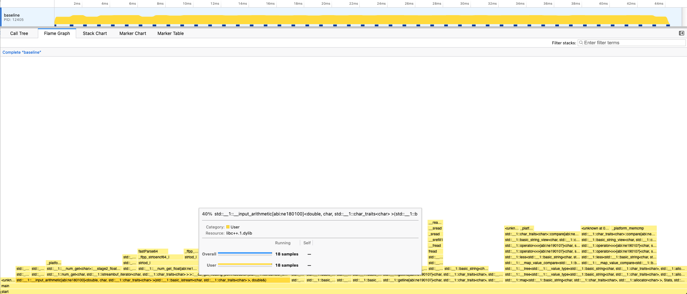

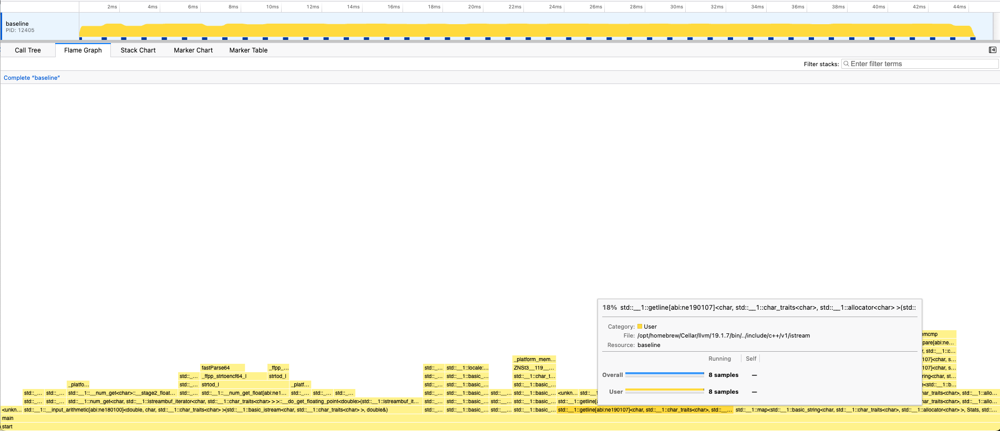

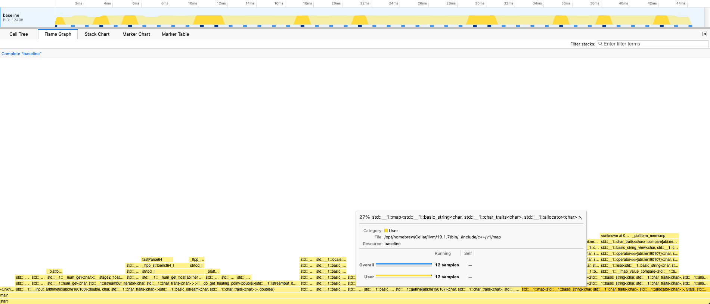

## 2. [single-thread optimized version (4m30s -> 1m47s)](https://github.com/s4piru/onebrcpp/commit/e5e3d8aec177517c9f1c5cdb04b6f014cb6d5acf)

### Overview

From the flame graph, I found that the two biggest bottlenecks were parsing numbers with `stringstream` and reading the file with `ifstream` / `getline`. So my first goal was to remove these bottlenecks.

Instead of using C++ standard library classes to read the file, I decided to use the `mmap` system call and read the file directly. For parsing the temperature values, I also implemented a custom parser instead of using `stringstream`.

By using `mmap`, I expected to reduce not only the overhead from the C++ standard library, but also the overhead caused by repeated system calls. Also, it avoids having separate caches in three places, OS, the standard library, and my own code.

### Changes from the previous version

1. Memory mapped IO with `mmap`

   Unlike ifstream or scanf(), with `mmap`, the file is directly mapped into memory. After that, the program can access the file as if it’s a large array on the memory. This doesn't mean the whole file is copied into the physical memory immediately, but the OS reads the contents into the file system cache as needed.

2. Simple parser functions for line splitting and number parsing. Pointer-pointer is used to maintain the current head location.

According to the profiling result, the `iostream` part used for output was not a hotspot at all. So I did not change it, partly to keep the code easier to read.

### Code

```cpp
#include <fcntl.h>
#include <sys/mman.h>
#include <sys/stat.h>
#include <unistd.h>

#include <cassert>
#include <iomanip>
#include <iostream>
#include <limits>
#include <map>
#include <string>

struct Stats {
  double min = std::numeric_limits<double>::infinity();
  double max = -std::numeric_limits<double>::infinity();
  double sum = 0;
  double count = 0;
};

double ParseDouble(const char** p) {
  bool negative = false;
  if (**p == '-') {
    negative = true;
    ++(*p);
  }
  double result = 0;
  while (**p != '.' && **p != '\\n') {
    result *= 10.0;
    result += static_cast<double>(**p - '0');
    ++(*p);
  }
  if (**p == '.') {
    ++(*p);
    result += static_cast<double>(**p - '0') / 10.0;
    ++(*p);
  }
  return negative ? -result : result;
}

std::pair<std::string, double> ParseLine(const char** p) {
  const char* start = *p;
  while (**p != ';') ++(*p);
  std::string name(start, *p - start);
  assert(**p == ';');
  ++(*p);
  double temp = ParseDouble(p);
  assert(**p == '\\n');
  ++(*p);
  return {name, temp};
}

int main(int argc, char* argv[]) {
  assert(argc >= 2);

  int fd = open(argv[1], O_RDONLY);
  struct stat sb;
  fstat(fd, &sb);
  const char* data =
      static_cast<const char*>(mmap(nullptr, sb.st_size, PROT_READ, MAP_PRIVATE, fd, 0));

  std::map<std::string, Stats> ma;
  const char* p = data;
  const char* end = data + sb.st_size;
  while (p < end) {
    auto [name, tmp] = ParseLine(&p);
    Stats& st = ma[name];
    st.min = std::min(st.min, tmp);
    st.max = std::max(st.max, tmp);
    st.sum += tmp;
    ++st.count;
  }

  munmap(const_cast<char*>(data), sb.st_size);
  close(fd);

  std::cout << std::fixed << std::setprecision(1);
  std::cout << "{";
  bool first = true;
  for (const auto& [name, st] : ma) {
    if (!first) {
      std::cout << ", ";
    }
    first = false;
    const double mean = st.sum / st.count;
    std::cout << name << "=" << st.min << "/" << mean << "/" << st.max;
  }
  std::cout << "}" << std::endl;

  return 0;
}
```

### Result

More than 2x improvement (4m30s -> 1m47s)

real 1m47.02s
user 1m39.45s
system 5.46s

### Profiling

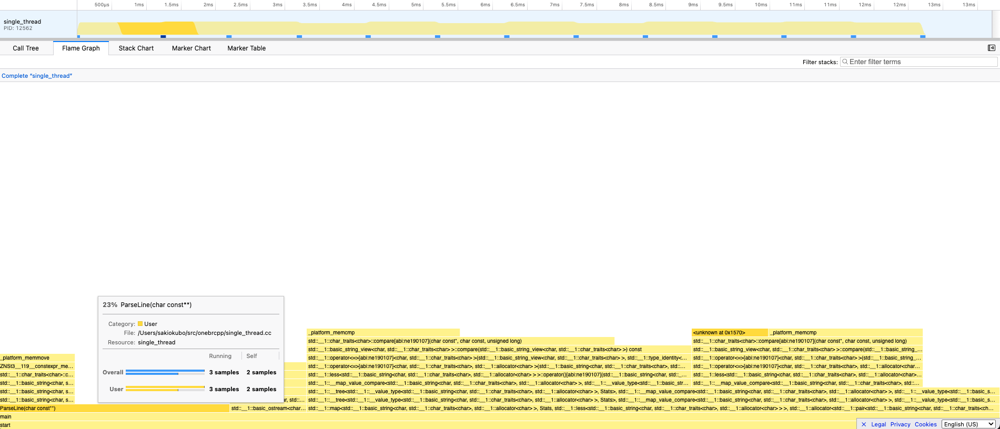

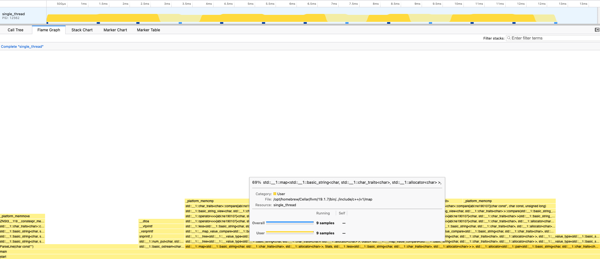

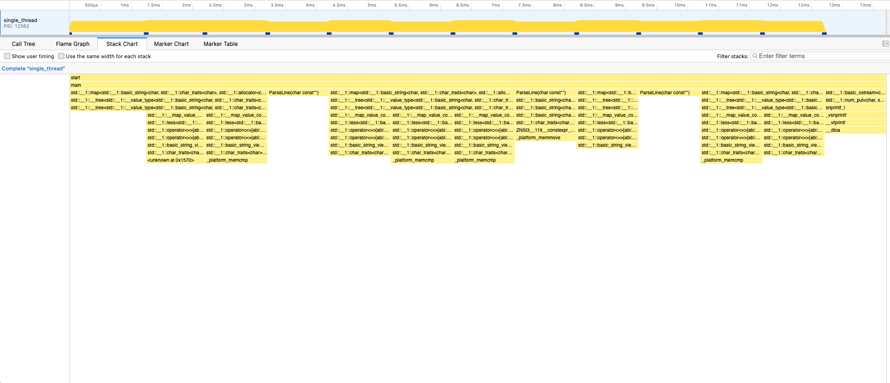


## 3. [Use string_view (1m47s -> 1m35s)](https://github.com/s4piru/onebrcpp/commit/3374eddac769b789959a0c3bcf56f76669aa0370)

### Overview

Although std::string instantiation is not the most dominant hotspot, changing it to std::string_view to avoid std::string copy is an easy way to make this slightly faster. One thing to note is that the std::map key should still be a std::string. Since the input array is a memory mapped file, std::map will need to read a random location in the original file every time referencing a key stored in the map, leading to huge performance regression.

- Changed `ParseLine` to return `std::string_view` instead of `std::string`
- To allow lookup of std::string keys with std::string_view, changed the map type from `std::map<std::string, Stats>` to `std::map<std::string, Stats, std::less<>>`

### Changes from the previous version

1. `ParseLine` returns `std::string_view`

   `std::string` instantiation copies the station name string. In contrast, `std::string_view` only stores the pointers and is substantially faster usually.

2. Change the map type from `std::map<std::string, Stats>` to `std::map<std::string, Stats, std::less<>>`

   This is necessary to look up `std::string` with `std::string_view`. Also we explicitly instantiate `std::string` when the station name is not found in the map before.

### Code

```cpp
#include <fcntl.h>
#include <sys/mman.h>
#include <sys/stat.h>
#include <unistd.h>

#include <cassert>
#include <iomanip>
#include <iostream>
#include <limits>
#include <map>
#include <string>
#include <string_view>

struct Stats {
  double min = std::numeric_limits<double>::infinity();
  double max = -std::numeric_limits<double>::infinity();
  double sum = 0;
  double count = 0;
};

double ParseDouble(const char** p) {
  bool negative = false;
  if (**p == '-') {
    negative = true;
    ++(*p);
  }
  double result = 0;
  while (**p != '.' && **p != '\\n') {
    result *= 10.0;
    result += static_cast<double>(**p - '0');
    ++(*p);
  }
  if (**p == '.') {
    ++(*p);
    result += static_cast<double>(**p - '0') / 10.0;
    ++(*p);
  }
  return negative ? -result : result;
}

std::pair<std::string_view, double> ParseLine(const char** p) {
  const char* start = *p;
  while (**p != ';') ++(*p);
  std::string_view name(start, *p - start);
  assert(**p == ';');
  ++(*p);
  double temp = ParseDouble(p);
  assert(**p == '\\n');
  ++(*p);
  return {name, temp};
}

int main(int argc, char* argv[]) {
  assert(argc >= 2);

  int fd = open(argv[1], O_RDONLY);
  struct stat sb;
  fstat(fd, &sb);
  const char* data =
      static_cast<const char*>(mmap(nullptr, sb.st_size, PROT_READ, MAP_PRIVATE, fd, 0));

  std::map<std::string, Stats, std::less<>> ma;
  const char* p = data;
  const char* end = data + sb.st_size;
  while (p < end) {
    auto [name, tmp] = ParseLine(&p);
    auto it = ma.find(name);
    if (it == ma.end()) {
      it = ma.emplace(std::string(name), Stats{}).first;
    }
    Stats& st = it->second;
    st.min = std::min(st.min, tmp);
    st.max = std::max(st.max, tmp);
    st.sum += tmp;
    ++st.count;
  }

  std::cout << std::fixed << std::setprecision(1);
  std::cout << "{";
  bool first = true;
  for (const auto& [name, st] : ma) {
    if (!first) {
      std::cout << ", ";
    }
    first = false;
    const double mean = st.sum / st.count;
    std::cout << name << "=" << st.min << "/" << mean << "/" << st.max;
  }
  std::cout << "}" << std::endl;

  munmap(const_cast<char*>(data), sb.st_size);
  close(fd);

  return 0;
}
```

### Result

The improvement was relatively small as expected. (1m47s -> 1m35s)

real 1m35.21s
user 1m27.45s
system 5.29s

### Profiling

After introducing `std::string_view`, `std::map` becomes an even more dominant hotspot.

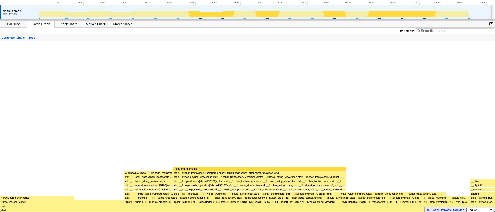

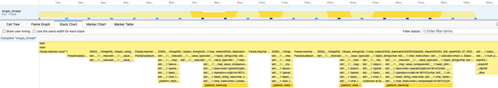

## 4. [Use unordered_map and sort keys later (1m35s -> 46s)](https://github.com/s4piru/onebrcpp/commit/4977a17167b5ff7ea27b7d5be0ff2c451129ca45)

### Overview

`std::map` is the biggest bottleneck so far. This makes sense because lookup in `std::map` is `O(log n)`, unlike `std::unordered_map`, which is expected to be `O(1)`. Also, comparing strings lexicographically is expensive.

So I am now replacing `std::map` with `std::unordered_map`.

Note that the problem requires the output to be sorted alphabetically by key, so we need to sort the keys at the end before printing.

### Changes from the previous version

1. Replace `std::map` with `std::unordered_map`

   The map changed from: std::map<std::string, Stats, std::less<>>
   to: std::unordered_map<std::string, Stats, StringHash, std::equal_to<>>

   StringHash, std::equal_to<> corresponds to std::less<> allowing lookup with `std::string_view` when the actual keys are `std::string`

2. Sort keys before printing

### Code

```cpp
struct StringHash {
  using is_transparent = void;
  size_t operator()(std::string_view sv) const {
    return std::hash<std::string_view>{}(sv);
  }
};
```

```cpp
std::unordered_map<std::string, Stats, StringHash, std::equal_to<>> ma;
```

```cpp
  std::vector<std::string> keys;
  keys.reserve(ma.size());
  for (const auto& [name, _] : ma) {
    keys.push_back(name);
  }
  std::sort(keys.begin(), keys.end());
```

### Result

The improvement was huge. (1m35s -> 46s)

real 46.723s
user 25.82s
system 4.46s

### Profiling

The new flame graph and stack chart show that the `std::map` bottleneck is gone. One thing you notice is that `std::unordered_map` performs string equality checks even if two strings have the same hash, which is becoming a new bottleneck.

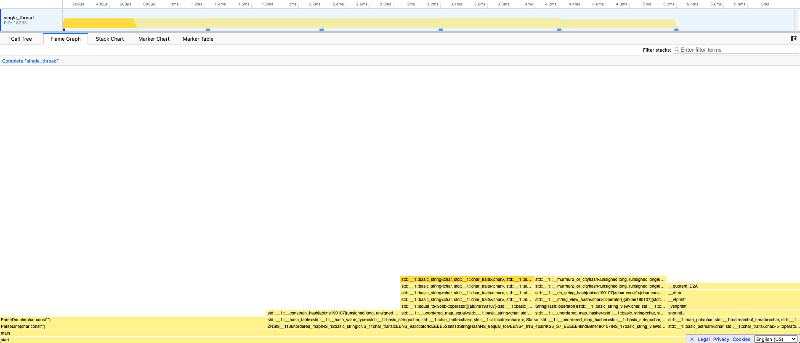

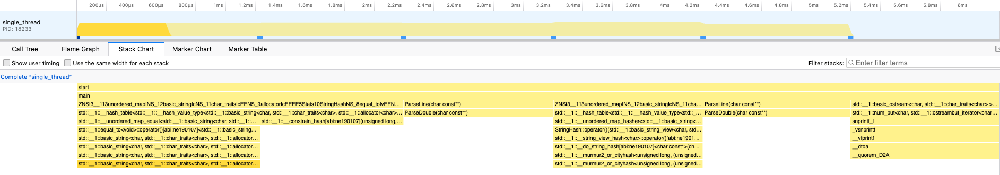


## 5. [Remove the equality check (25s user -> 19s user) total 44s](https://github.com/s4piru/onebrcpp/commit/f8c64ab4c7f72088b030fe153dc23d4d817403fc)

### Overview

Given the input constraint that we only have < 500 unique input keys and there’s no malicious keys, you can realistically expect std::hash to have no collisions. In a typical implementation like libc++ std::hash is MurmurHash internally, as you can confirm in the flamegraph. By specifying the AlwaysEqual comparator, you can bypass the equality check in `std::unordered_map`.

### Changes from the previous version

* `AlwaysEqual` comparator which always returns true
* Specify `AlwaysEqual` as a comparator used in `std::unordered_map`

### Code

```cpp
struct AlwaysEqual {
  using is_transparent = void;
  template <typename T, typename U>
  bool operator()(const T&, const U&) const { return true; }
};
```

```cpp
std::unordered_map<std::string, Stats, StringHash, AlwaysEqual> ma;
```

### Result

User (25s user -> 19s) and Total (46s -> 44s):

real 44.512s
user 19.62s
system 4.40s

### Profiling

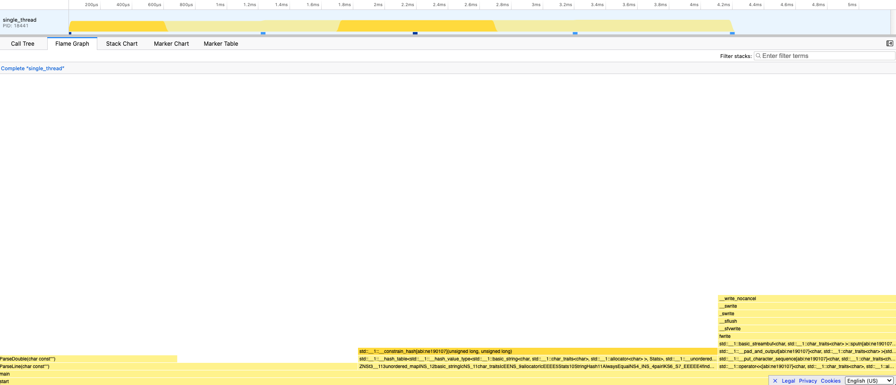

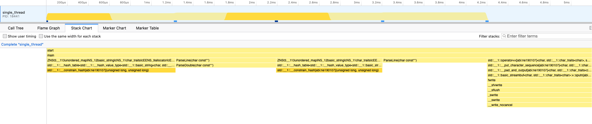


## 6. [Use madvise(MADV_SEQUENTIAL) 44s -> 39s](https://github.com/s4piru/onebrcpp/commit/ddd6c0b885a9957e80cc75ae8275463882283e74)

### Overview

At this point there are few easy wins left, but one quick trick we can still try is `madvise`. `madvise` is a syscall that gives the OS a hint that the memory mapped file will be read sequentially by the program, resulting in better file system caching / prefetching.

### Code

```cpp
madvise(const_cast<char*>(data), sb.st_size, MADV_SEQUENTIAL);
```

### Result

44s -> 39s

real 39.268s
user 18.79s
system 1.42s

### Profiling

`ParseLine` is still the main hotspot, but at this point there are no obvious easy optimization opportunities left.

Also, we are now processing a 12 GB file in 39 seconds. That means the throughput is:

`12,000 MB / 39 sec ≈ 308 MB/s`

Looking at the flame graph, I did not find any remaining part that looked easy to optimize. So, I will try making the implementation multi-threaded.

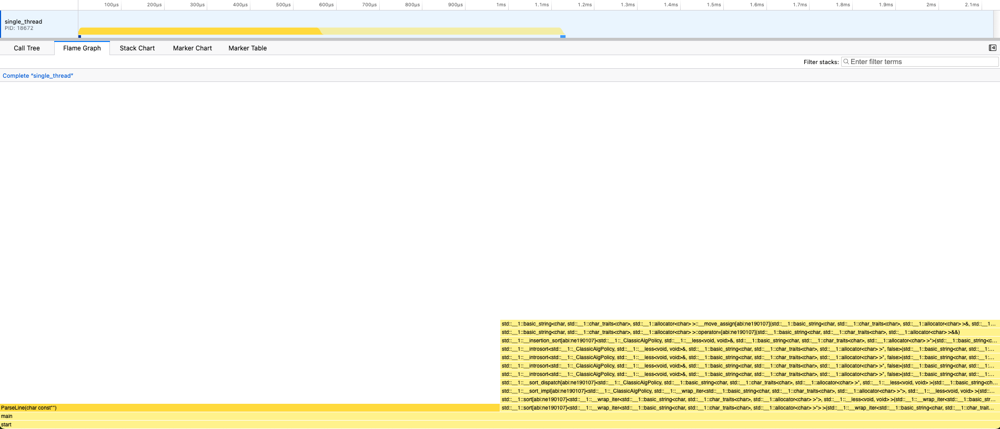

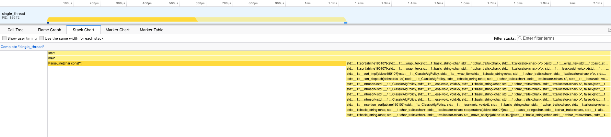

## 7. Things I tried and didn’t really work

- Using integers for temperatures:

  Because the input temperature has a limited value range and only one digit after the decimal point, it is possible to avoid `double`. Instead, we can store intermediate values as `int64_t` by multiplying the temperature by 10, and then divide by 10 only at the end.

- Using `memchr` for SIMD:

  Currently, `ParseLine` processes the input one character at a time, and finding the semicolon separator is expensive. Since `memchr` usually uses SIMD internally, in theory it should be faster.

  However, when I tried it, it did not improve performance much. The likely reason is that station names are too short, so even if SIMD is used, there is not enough work per string to get a meaningful speedup.

## 8. [Multi-thread Version](https://github.com/s4piru/onebrcpp/blob/main/multi_thread.cc)

### Overview

Given that the single-threaded version is CPU bound, one can expect that making it multi-threaded will significantly speed up the total execution time. The idea is to keep the change as minimal as possible from the optimized single-threaded version, by simply splitting the original input file into chunks, processing each chunk in a different CPU core, and then merging the results in the end. Given that each chunk results in a single map output, I decided to use std::future instead of std::thread to cleanly handle this use case.

### Changes from the previous version

1. ProcessChunk(): the inside is generally similar to what was done in the single-threaded version. One minor difference is that there’s no guarantee that each chunk has clean start and end offsets that align with each line boundary. To handle that, we skip until the next new line emerges, and processes beyond the end offset until you see the line end.

2. Merge() is a simple function that takes a vector of maps and returns a merged map.

3. Run with `std::async`

   By default std::async runs functions in a thread pool, so there’s no guarantee that they will run on separate cores. This behavior can be overridden by using std::launch::async which forces each function to run on a dedicated thread.

### Code

```cpp
#include <fcntl.h>
#include <sys/mman.h>
#include <sys/stat.h>
#include <unistd.h>

#include <cassert>
#include <future>
#include <iomanip>
#include <iostream>
#include <limits>
#include <algorithm>
#include <string>
#include <string_view>
#include <thread>
#include <unordered_map>
#include <vector>

struct StringHash {
  using is_transparent = void;
  size_t operator()(std::string_view sv) const {
    return std::hash<std::string_view>{}(sv);
  }
};

struct AlwaysEqual {
  using is_transparent = void;
  template <typename T, typename U>
  bool operator()(const T&, const U&) const { return true; }
};

struct Stats {
  double min = std::numeric_limits<double>::infinity();
  double max = -std::numeric_limits<double>::infinity();
  double sum = 0;
  double count = 0;
};

using Map = std::unordered_map<std::string, Stats, StringHash, AlwaysEqual>;

double ParseDouble(const char** p) {
  bool negative = false;
  if (**p == '-') {
    negative = true;
    ++(*p);
  }
  double result = 0;
  while (**p != '.' && **p != '\\n') {
    result *= 10.0;
    result += static_cast<double>(**p - '0');
    ++(*p);
  }
  if (**p == '.') {
    ++(*p);
    result += static_cast<double>(**p - '0') / 10.0;
    ++(*p);
  }
  return negative ? -result : result;
}

std::pair<std::string_view, double> ParseLine(const char** p) {
  const char* start = *p;
  while (**p != ';') ++(*p);
  std::string_view name(start, *p - start);
  ++(*p);
  double temp = ParseDouble(p);
  ++(*p);
  return {name, temp};
}

// Takes a pointer to data, start offset and end offset, and returns a map.
// Skips until the beginning of the line unless it's the first chunk.
// Handles until the end of the last line which might be after the end of the chunk.
Map ParseChunk(const char* data, size_t start, size_t end, size_t file_size) {
  const char* p = data + start;
  const char* file_end = data + file_size;

  if (start != 0) {
    while (p < file_end && *(p - 1) != '\\n') ++p;
  }

  const char* chunk_end = data + end;
  if (end < file_size) {
    while (chunk_end < file_end && *(chunk_end - 1) != '\\n') ++chunk_end;
  }

  Map ma;
  while (p < chunk_end) {
    auto [name, tmp] = ParseLine(&p);
    auto it = ma.find(name);
    if (it == ma.end()) {
      it = ma.emplace(std::string(name), Stats{}).first;
    }
    Stats& st = it->second;
    st.min = std::min(st.min, tmp);
    st.max = std::max(st.max, tmp);
    st.sum += tmp;
    ++st.count;
  }

  return ma;
}

// Takes a vector of maps and returns a map.
Map Merge(const std::vector<Map>& maps) {
  Map result;
  for (const auto& ma : maps) {
    for (const auto& [name, st] : ma) {
      auto it = result.find(name);
      if (it == result.end()) {
        result.emplace(name, st);
      } else {
        Stats& r = it->second;
        r.min = std::min(r.min, st.min);
        r.max = std::max(r.max, st.max);
        r.sum += st.sum;
        r.count += st.count;
      }
    }
  }
  return result;
}

void Print(const Map& ma) {
  std::vector<std::string> keys;
  keys.reserve(ma.size());
  for (const auto& [name, _] : ma) {
    keys.push_back(name);
  }
  std::sort(keys.begin(), keys.end());

  std::cout << std::fixed << std::setprecision(1);
  std::cout << "{";
  bool first = true;
  for (const auto& name : keys) {
    const Stats& st = ma.find(name)->second;
    if (!first) {
      std::cout << ", ";
    }
    first = false;
    const double mean = st.sum / st.count;
    std::cout << name << "=" << st.min << "/" << mean << "/" << st.max;
  }
  std::cout << "}" << std::endl;
}

int main(int argc, char* argv[]) {
  assert(argc >= 2);

  int fd = open(argv[1], O_RDONLY);
  struct stat sb;
  fstat(fd, &sb);
  const char* data =
      static_cast<const char*>(mmap(nullptr, sb.st_size, PROT_READ, MAP_PRIVATE, fd, 0));
  madvise(const_cast<char*>(data), sb.st_size, MADV_SEQUENTIAL);

  // Create as many futures as the number of cores.
  unsigned int num_threads = std::thread::hardware_concurrency();
  if (num_threads == 0) num_threads = 1;
  const size_t chunk_size = sb.st_size / num_threads;

  // Split the file into chunks, each thread gets its own map.
  std::vector<std::future<Map>> futures;
  for (unsigned int i = 0; i < num_threads; ++i) {
    size_t start = i * chunk_size;
    size_t end = (i == num_threads - 1) ? sb.st_size : (i + 1) * chunk_size;
    futures.push_back(std::async(std::launch::async, ParseChunk, data, start, end, sb.st_size));
  }

  std::vector<Map> maps;
  maps.reserve(num_threads);
  for (auto& f : futures) {
    maps.push_back(f.get());
  }

  // Merge at the end.
  Map ma = Merge(maps);
  Print(ma);

  munmap(const_cast<char*>(data), sb.st_size);
  close(fd);

  return 0;
}
```

### Result

Significant improvement (39s -> 7s)

real 7.180s
user 22.039s
system 3.328s

### Profiling

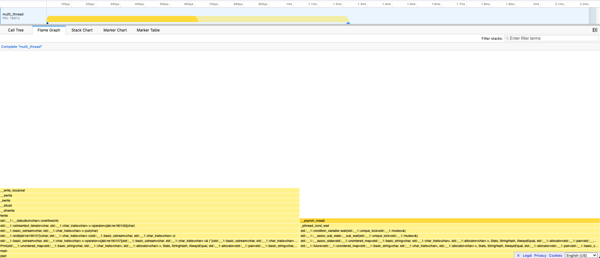

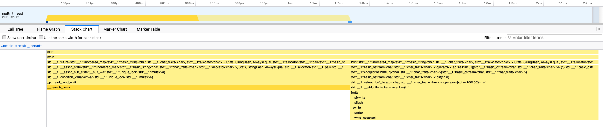

## Setup & Run

### Get the original 1BRC repository

```
git submodule update --init --recursive
```

### Generate Input Data

```bash
./generate_input.sh
```

### Run

```bash
./run_baseline.sh
./run_single_thread.sh
./run_multi_thread.sh
```

- real time: wall-clock time
- user time: CPU time spent in user-space code
- sys time: CPU time spent in kernel/system calls

### Profiler (MacOS)

```
brew install samply
clang++ -std=c++20 -O3 -Wall -Wextra -g -fno-omit-frame-pointer -o baseline baseline.cc
head -n 100000 measurements.txt > measurements100k.txt
samply record ./baseline measurements100k.txt
```

## Appendix

### Repository Structure

- generate_input.sh: Generates a input file(measurements.txt) and expected output(expected_output.txt).
- baseline.cc: Simplest implementation.
- single_thread.cc: Optimized single-threaded implementation.
- multi_thread.cc: Multithreaded implementation.
- run_baseline.sh: Run baseline.cc.
- run_single_thread.sh: Run single_thread.cc.
- run_multi_thread: Run multi_thread.cc.

### Environment

- The optimized implementations use Unix-specific APIs. So the code is intended for Linux or macOS.
- Tested on Apple M2 Pro with 32 GB Memory.

